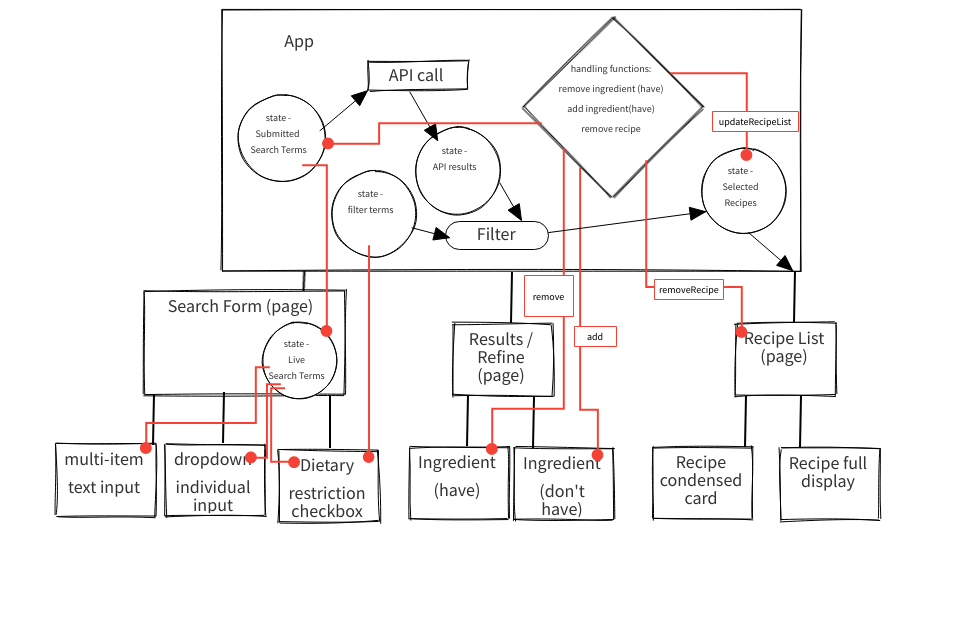
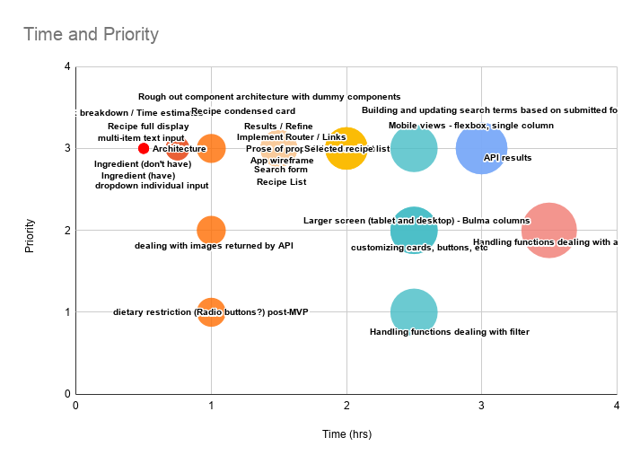

# Project Overview

## Project Links

- [github repo](https://github.com/norrichs/whatsinfridge)
- [deployed](https://fridge.norrichs.com/)

## Project Description

This app is a recipe explorer that accesses a recipe / incredient API.
The user can provide data in a few ways.
- Input ingredients by text
- Select ingredients from dropdown lists from a number of categories

The input data will be used to retrieve a recipe list of dishes that utilize the entered ingredients.  A list of n

This functionality has already been implemented well in other apps
- [supercook.com](https://supercook.com)
- [allrecipes.com](https://allrecipes.com)

Knowing that I can't reproduce all of their extensive functionality and beautifully presented photography, I'll focus on a streamlined approach to very quickly get from selecting ingredients to getting a recipe you can cook NOW.

## API


```
inputs: "rice, peas, carrots, cabbage"

[5 items
0:{10 items
"id":747831
"title":"Korean BBQ Short Ribs"
"image":"https://spoonacular.com/recipeImages/747831-312x231.jpeg"
"imageType":"jpeg"
"usedIngredientCount":5
"missedIngredientCount":20
"missedIngredients":[...]20 items
"usedIngredients":[...]5 items
"unusedIngredients":[...]1 item
"likes":86
}
1:{10 items
"id":213444
"title":"Spicy vegetable egg fried rice"
"image":"https://spoonacular.com/recipeImages/213444-312x231.jpg"
"imageType":"jpg"
"usedIngredientCount":4
"missedIngredientCount":5
"missedIngredients":[...]5 items
"usedIngredients":[...]4 items
"unusedIngredients":[...]1 item
"likes":127
}
2:{10 items
"id":94357
"title":"Filipino Fried Rice"
"image":"https://spoonacular.com/recipeImages/94357-312x231.jpg"
"imageType":"jpg"
"usedIngredientCount":4
"missedIngredientCount":6
"missedIngredients":[...]6 items
"usedIngredients":[...]4 items
"unusedIngredients":[...]1 item
"likes":6
}
3:{10 items
"id":664553
"title":"Vegetable Fried Rice"
"image":"https://spoonacular.com/recipeImages/664553-312x231.jpg"
"imageType":"jpg"
"usedIngredientCount":4
"missedIngredientCount":9
"missedIngredients":[...]9 items
"usedIngredients":[...]4 items
"unusedIngredients":[...]1 item
"likes":2
}
4:{10 items
"id":94126
"title":"Savory Chicken Egg Rolls With Sweet and Sour Sauce"
"image":"https://spoonacular.com/recipeImages/94126-312x231.jpg"
"imageType":"jpg"
"usedIngredientCount":4
"missedIngredientCount":11
"missedIngredients":[...]11 items
"usedIngredients":[...]4 items
"unusedIngredients":[...]1 item
"likes":1
}
]
```


## Wireframes

Upload images of wireframe to cloudinary and add the link here with a description of the specific wireframe. Also, define the the React components and the architectural design of your app.

#### React Architecture

- [add link to your wireframes]()


### MVP/PostMVP - 5min

The functionality will then be divided into two separate lists: MPV and PostMVP.  Carefully decided what is placed into your MVP as the client will expect this functionality to be implemented upon project completion.  

#### MVP
##### Main functionality
	- Use the Spoonacular API to search for recipes, accepting the following inputs
		- ingredients listed as comma separated strings
		- ingredients written in additional text inputs
		- negated ingredients from presented list
		- general category inputs (dietary restrictions, dish types)
	- Results of API search will be presented as a concise list of recipes
	- Results of API search will be presented as concise list of additionally required ingredients
	- Any recipe result will accept a user click to add it to a "saved list"
##### Views
	- Initial selection view
		- text input allows single or list of ingredients to be typed
		- below that a random list of common ingredients can be clicked, which will add text to text input box
		- submit button transitions to Secondary view
	- Results / Refine View
		- current selected ingredient list
			- X button attached to each list item to remove from list
		- current returned recipe list
			- recipes can be "saved"
		- current "additional ingredient" list
			- additional ingredients can be either added to selected ingredient list or added to exclusion list
	- Saved recipes view
		- Saved recipes presented in long form
		- Items can be removed from list
	- Individual recipe view
##### Styling / Design
	- General
		- I'll use a css framework.  Leaning towards Bulma
		- Lots of icons
		- Images, when returned by api
	- Mobile view
		- Vertical scrolling, column based
		- Color changes will indicate which section is being viewed (sections =  input, recipe lists, ingredients lists)
#### PostMVP

	- Secondary API for photos (flickr? instagram?)
	- Export to shopping list feature
		- clickable list?
		- send to email / text for sharing?
	- Use a CMS or maybe just Google sheets to save recipes for later


## Components
##### Writing out your components and its descriptions isn't a required part of the proposal but can be helpful.

Based on the initial logic defined in the previous sections try and breakdown the logic further into stateless/stateful components. 


| Component | Description | 
| --- | :---: |  
| App | This will make the initial data pull and include React Router| 
| Header | This will render the header include the nav | 
| Footer | This will render the header include the nav | 
| Search Page |  |
| Results / Refine Page |  |
| Saved recipes Page    | Lists the selected recipes |
| recipe button |  |
| ingredients button |  |
| recipe card (condensed) |  |
| recipe card (full detail) |  |


Time frames 

| Task | Priority | Estimated Time | Time Invested | Actual Time |
| --- | :---: | :---: | :---: | :---: |
| Rough out component architecture with dummy components | H | 2 |  |  |
| Implement Router / Links | H | 1.5 |  |  |
| **Implement low-level components** |  |  |  |  |
| multi-item text input | H | 0.5 |  |  |
| dropdown individual input | H | 0.5 |  |  |
| dietary restriction (Radio buttons?) post-MVP | L | 1 |  |  |
| Ingredient (have) | H | 0.5 |  |  |
| Ingredient (don't have) | H | 0.5 |  |  |
| Recipe condensed card | H | 1 |  |  |
| Recipe full display | H | 0.75 |  |  |
| **Implement page components** |  |  |  |  |
| Search form | H | 1.5 |  |  |
| Results / Refine | H | 1.5 |  |  |
| Recipe List | H | 1.5 |  |  |
| **Deal with state** |  |  |  |  |
| Building and updating search terms based on submitted form inputs | H | 2.5 |  |  |
| API results | H | 3 |  |  |
| Selected recipe list | H | 2 |  |  |
| Handling functions dealing with altering state | M | 3.5 |  |  |
| Handling functions dealing with filter | L | 2.5 |  |  |
| **Layout** |  |  |  |  |
| Mobile views - flexbox, single column | H | 3 |  |  |
| Larger screen (tablet and desktop) - Bulma columns | M | 2.5 |  |  |
| **Styling** |  |  |  |  |
| customizing cards, buttons, etc | M | 2.5 |  |  |
| dealing with images returned by API | M | 1 |  |  |
| **Total** |  | **41.75** | **4** | **0** |



## Additional Libraries
- Bulma
- SASS

## Code Snippet

Use this section to include a brief code snippet of functionality that you are proud of an a brief description.  Code snippet should not be greater than 10 lines of code. 

```
function reverse(string) {
	// here is the code to reverse a string of text
}
```


## Issues

I want to restrict access to parts of the app that require user input data to be valid

PrivateRoute might do the trick


I want to have a fixed static header for the Results, Recipes, and About pages.  The Search page should not have a header
Need to make sure that the header doesn't re-render when proceeding through the pages
- Not a problem